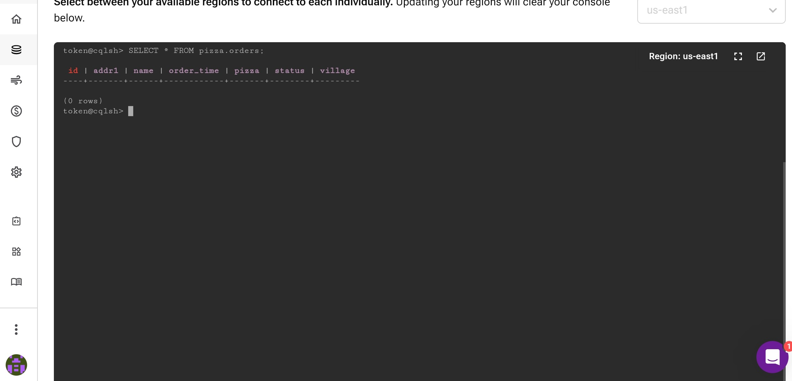
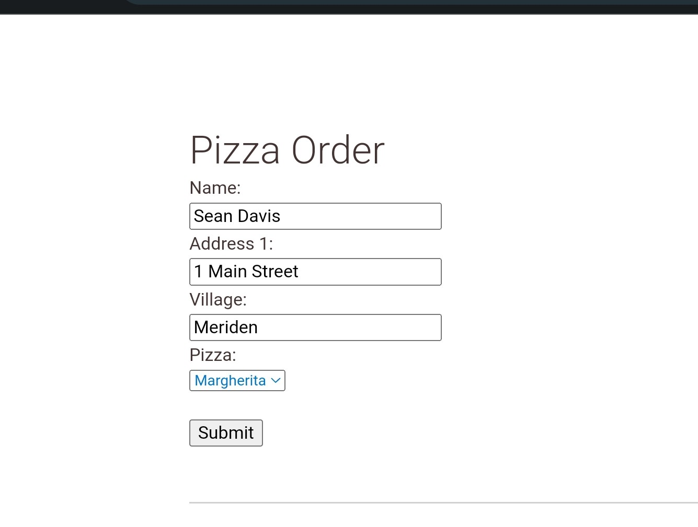
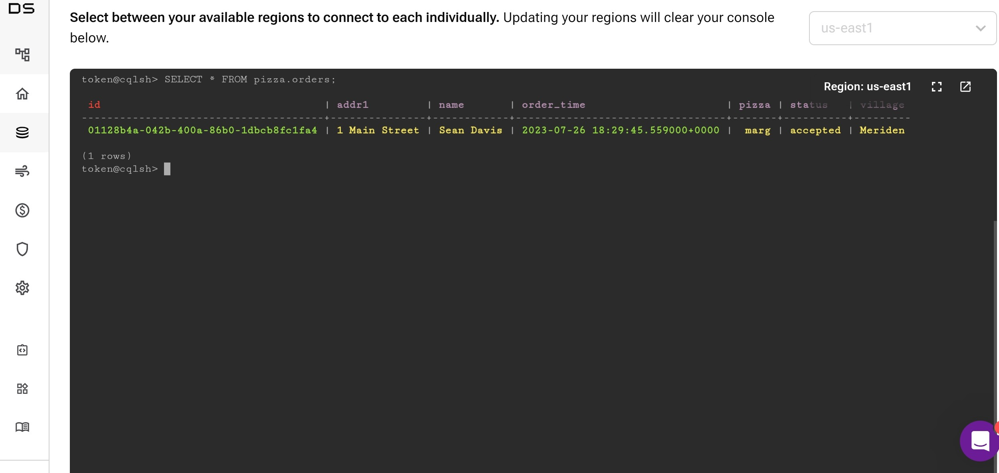
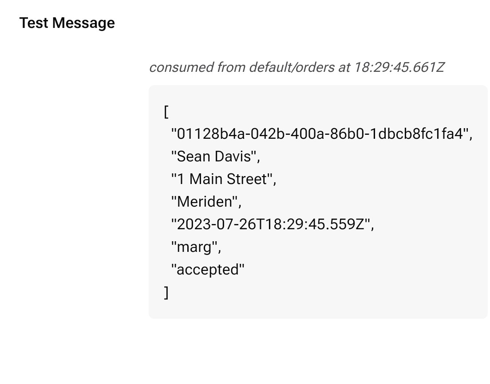
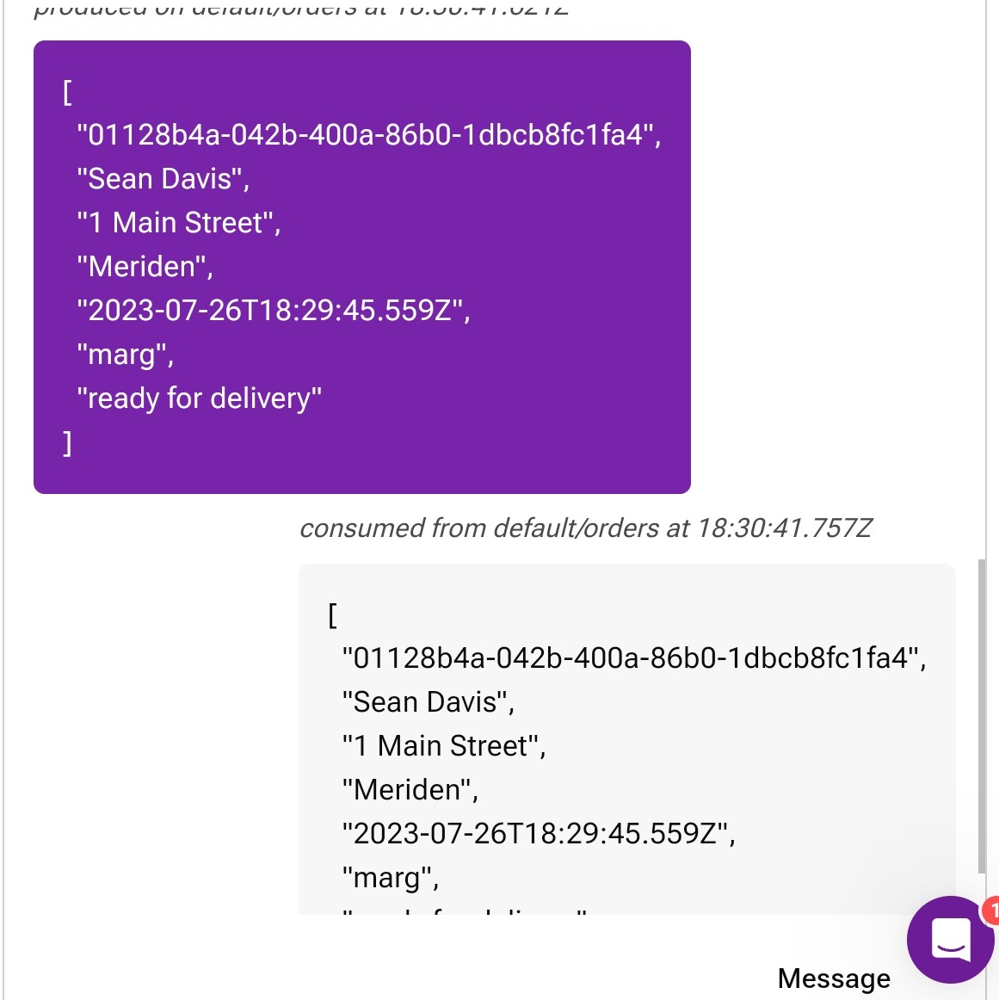
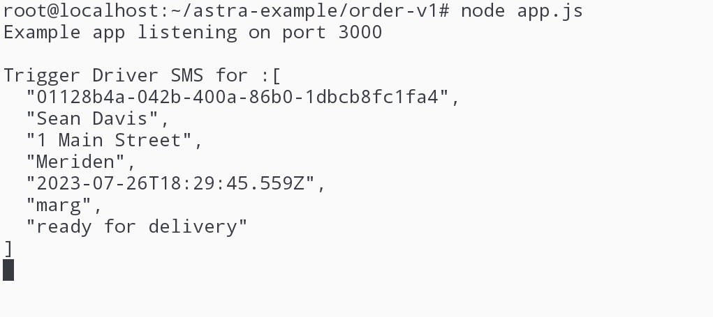
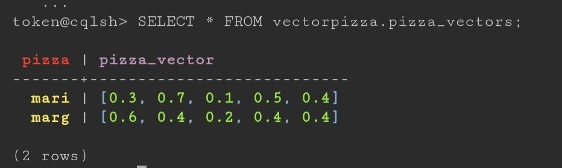
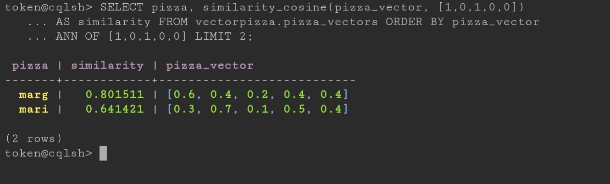

# Pizza Project

A dummy project to play with Datastax applications

## Requirements

```
Feature: 
  As a pizza restaurant
  I want a computerised order system
  So that I reduce human errors in pizza delivery

  Scenario: Customer successfully orders a Pizza
    Given the menu contains
     | Marinara   |
     | Margherita |
    And the restaurant delivers to these villages
     | Balsall Common |
     | Berkswell      |
     | Meriden        |
    When I customer places a telephone order
    And the assistant takes their name, address and pizza type
    Then the pizza is cooked
    And the driver receives an SMS
    And the pizza is delivered
    
  Scenario: Customer successfully receives a recommendation
    Given a customer provides their village 
    When the assistant requests a recommendation based on the time and pizza type
    Then based on previous orders, a good recommendation is made

```


## Design

```

Clients    Point of sale client           Driver client (SMS)         Kitchen client (Try it out in Astra)
                  |                             |                    |
                  ----------------------------------------------------
                           |                            |
Messaging                  |                    AstraStreaming
                           |                            |
                           ------------------------------
                              |            |       
uSvcs                     Order       Recommendation
                              |            |        
                              -------      -------
                                    |            |
Data                             AstraDB -- (Vector Search)

```

## Implementation Notes

- Register for free datastax account
- create our db and a keyspace for our microservice
- downloaded SCB zip file via cli
- created a svc account and set up astra-cli

```
astra db create pizzadb -k pizza --if-not-exist --wait
astra db cqlsh pizzadb -e "CREATE TABLE IF NOT EXISTS pizza.orders (
id uuid PRIMARY KEY,
name text,
addr1 text,
village text,
order_time timestamp,
pizza text,
status text
)"
```

- Created the streaming tenant in the UI (pizza)
- Added an 'orders' topic to the default namescape
- Wrote couple of apps to test the functionality
- Stored all relevant secrets in environment variables

## Demo

We start with an empty table



We make an order in the point of sale UI



This triggers a Astra DB write and a Astra Streaming publish event



The kitchen receives the event



Cooks the pizza and sends an updated event with a status of 'cooking'


Once finished, it sends an updated event with a status 'ready for delivery'



Our Pulsar client consumes this event and triggers a dummy SMS to the driver to notify them



## Recommendations

After enough orders, we can use historic data to provide pizza recommendations based on location and order time.

I created a vectordb to test a simple recommendation method.

Using dummy data, you can imagine the below weights for pizza orders. e.g. When someone orders a Marinara, 30% of the time it is at lunch and 40% of the time it is from Meriden.

|pizza | lunch | dinner | berkswell | balsall | meriden |
|------|-------|--------|-----------|---------|---------|
|mari  | 0.3   | 0.7    | 0.1       | 0.5     | 0.4     |
|marg  | 0.6   | 0.4    | 0.2       | 0.4     | 0.4     |

We can load these into a table and use the similarity cosine function to find the approximate nearest neighbour.


```sh
astra db cqlsh vectordb -e "CREATE TABLE vectorpizza.pizza_vectors (
  pizza TEXT PRIMARY KEY, 
  pizza_vector vector<float, 5>);
CREATE CUSTOM INDEX ON vectorpizza.pizza_vectors (pizza_vector) USING 'StorageAttachedIndex';
INSERT INTO vectorpizza.pizza_vectors (pizza, pizza_vector)
  VALUES ('mari', [0.3, 0.7, 0.1, 0.5, 0.4]);
INSERT INTO vectorpizza.pizza_vectors (pizza, pizza_vector)
  VALUES ('marg', [0.6, 0.4, 0.2, 0.4, 0.4]);
SELECT * FROM vectorpizza.pizza_vectors;"
```



We can use this to find a recommendation for a pizza at Lunch time in Meriden
```
astra db cqlsh pizzadb -e "SELECT pizza, similarity_cosine(pizza_vector, [1,0,1,0,0]) 
AS similarity FROM vectorpizza.pizza_vectors ORDER BY pizza_vector 
ANN OF [1,0,1,0,0] LIMIT 2;"
```



At Lunchtime in Meriden, we would recommend a Margherita!


